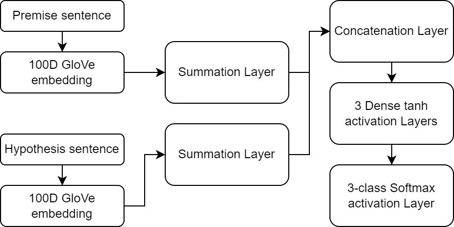
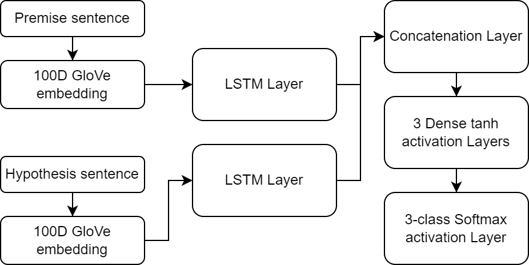
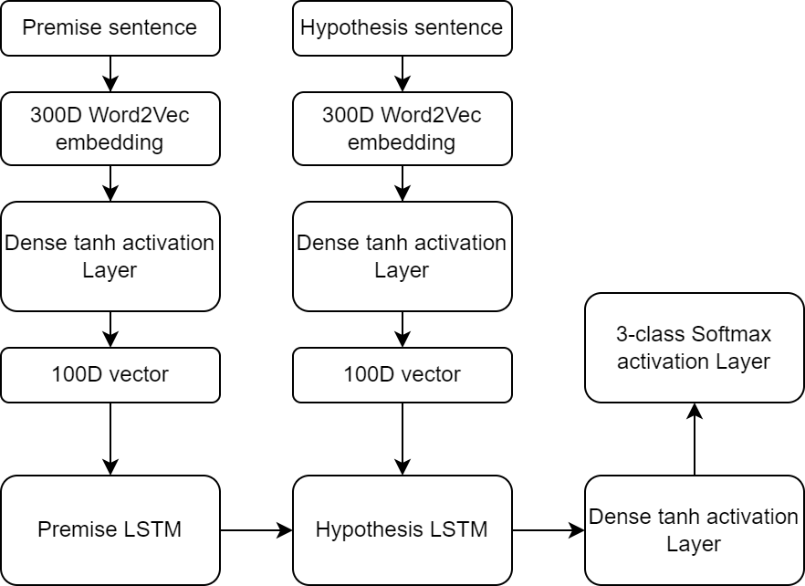

# Textual Entailment

This project focuses on Natural Language Inference, and developing machine learning models in order to classify a given premise and hypothesis as contextually and logically entailing, contradicting, or being neutral.
The project consists of a comparitive analysis of 3 different types of models, over 4 different datasets

## Datasets

The following datasets are being .

- SNLI ([Link](https://nlp.stanford.edu/projects/snli/))
  - 530k sentence pairs
  - Stanford had custom sentence pairs manually written out by labelled by humans, that being SNLI.
- MultiNLI ([Link](https://cims.nyu.edu/~sbowman/multinli/))
  - 433k sentence pairs
  - MultiNLI is a crowd-sourced dataset, which differs from SNLI where it has more cross-genre generalization, and a more varied dataset.
- SciTail ([Link](https://allenai.org/data/scitail))
  - 27k sentence pairs
  - SciTail was created from science multiple choice quizzes, where each question and correct answer pair is labelled as entailment.
- SICK ([Link](https://paperswithcode.com/dataset/sick))
  - 10k sentence pairs
  - SICK was created by taking datasets which have sentences that describe particular images, and labelling these descriptions.

## Models

### Bowman Model
#  

##
### Simple LSTM Model
#

##
### Shared LSTM Model
#

##
## Directory Structure

- **Datasets**: Contains the 4 datasets, along with the GloVe, Word2Vec, and BERT embeddings. Due to GitHub size constraints, most of the data has not been pushed.
- **Docs**: Contains the documents used for the presentation and documentation of this project
- **Models**: Contains the pre-trained models for all the datasets, that can be loaded in the notebooks.
- **Src**: Contains all the source code of the project, in the form of jupyter notebooks. This folder is further subdivided into categorical notebooks for each model, along with some experimental notebooks used in the development of earlier parts of the project.